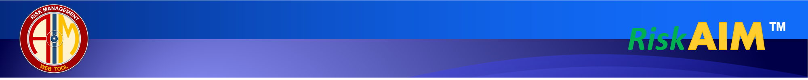
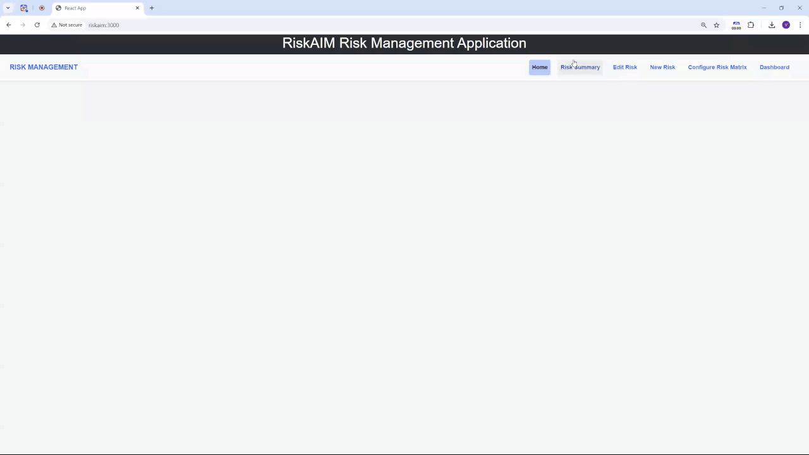
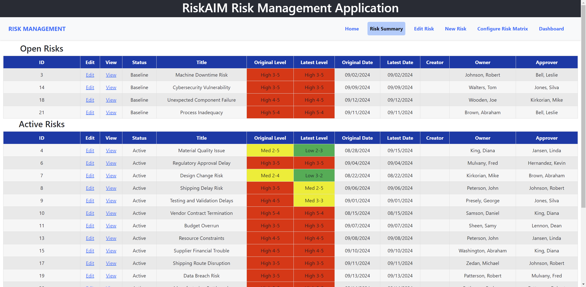
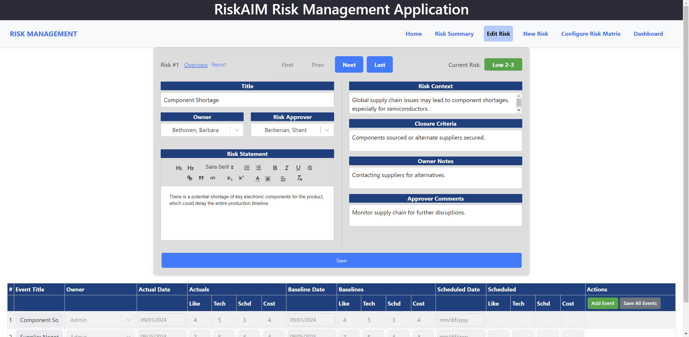
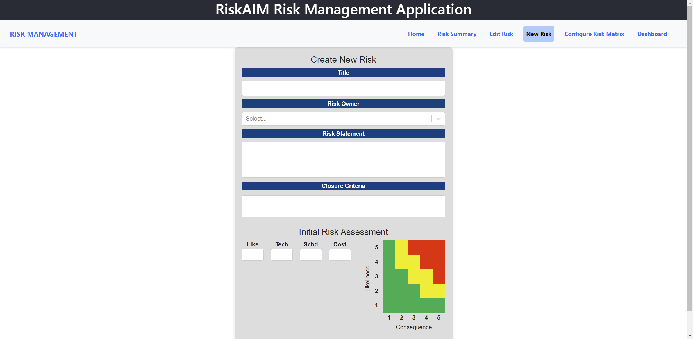
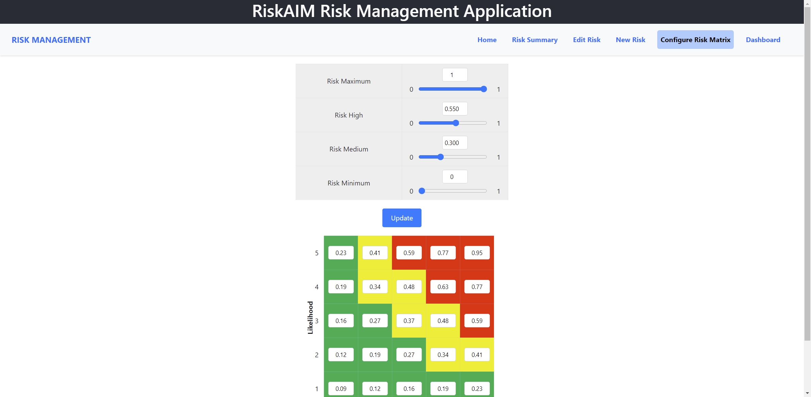
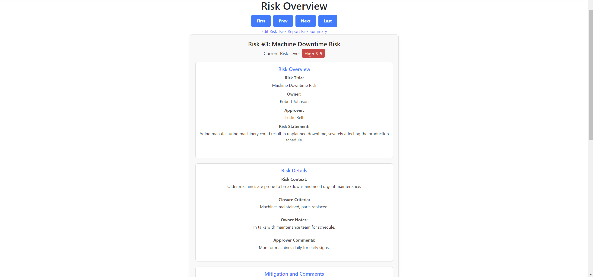
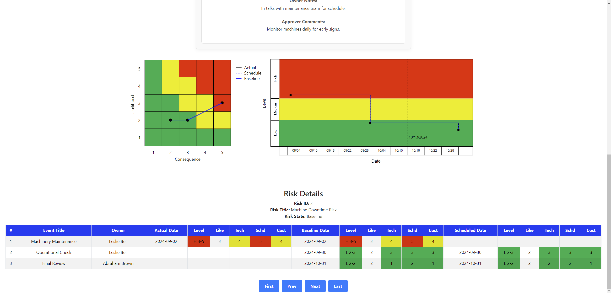
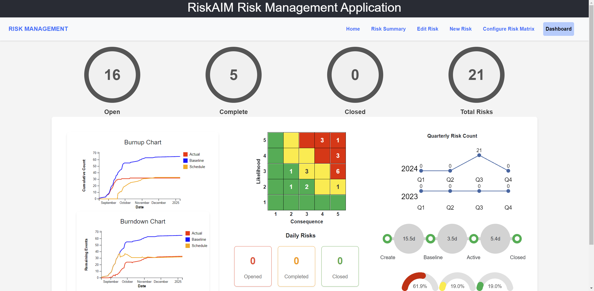

<object data="docs/screenshots/Banner.svg" type="image/svg+xml">
  
</object>

<p align="center">
  
  
  
  
</p>

---





## Table of Contents

- [Overview](#overview)
- [Key Features](#key-features)
- [Screenshots](#screenshots)
- [Technologies Used](#technologies-used)
- [Installation](#installation)
- [Usage](#usage)
- [Contributing](#contributing)
- [License](#license)
- [Contact](#contact)

---

## Overview

> **“Simplifying risk management, empowering organizations to proactively address potential challenges.”**

The **RiskAIM Risk Management Application** is a comprehensive tool designed to assist businesses in identifying, assessing, and managing risks in their daily operations. This user-friendly application provides a centralized platform that makes risk management an efficient and systematic process.

Upon logging into the application, users are directed to the **Home** page, serving as the central hub for accessing the various functionalities of the application.

### Application Sections

| 🗂️ **Section**             | 📖 **Description**                                                                                                                                  |
|----------------------------|------------------------------------------------------------------------------------------------------------------------------------------------------|
| **Home**                   | Central hub for accessing all features and viewing ongoing risk management activities.                                                                |
| **Risk Summary**           | Detailed synopsis of all identified risks, including status, severity, and mitigation measures.                                                       |
| **Edit Risk**              | Modify details of identified risks to keep information accurate and up-to-date.                                                                       |
| **New Risk**               | Input new risk data, detailing the potential risk, its likelihood, impact, and proposed mitigation strategies.                                        |
| **Configure Risk Matrix**  | Customize the parameters by which risks are rated and assessed to align with your organization's specific needs.                                      |
| **Dashboard**              | Visual representation of the risk landscape through charts, graphs, and other visual aids, aiding in monitoring and communicating risk status.        |

---

## Key Features

- 🚀 **Centralized Risk Management**: Identify, assess, and manage risks from a single platform.
- ✏️ **Dynamic Editing**: Update risk details to reflect the current state of affairs.
- ⚙️ **Customizable Risk Matrix**: Tailor the risk assessment parameters to align with organizational needs.
- 📊 **Visual Dashboards**: Understand risk distributions and relationships through graphical representations.
- 🖥️ **User-Friendly Interface**: Navigate seamlessly through the application with an intuitive design.
- 📚 **Comprehensive Documentation**: Access detailed information and guidance within the application.

---

## Screenshots

### Risk Summary

Provides an overview of all identified risks, along with their severity and potential impact on the business.

<p align="left">
  
</p>

### Edit Risk

Modify risk details such as the risk description, assigned personnel, and proposed mitigation strategies.

<p align="left">
  
</p>

### New Risk

Input new risk data, detailing potential risks, their likelihood, impact, and mitigation strategies.

<p align="left">
  
</p>

### Configure Risk Matrix

Customize the parameters by which risks are rated and assessed, ensuring alignment with your operational context.

<p align="left">
  
</p>

### Risk Overview and Risk Matrix / Waterfall Charts

View readonly details of a risk along with Risk Charts and Event Summary

<p align="left">
  
</p>

<p align="left">
  
</p>


### Dashboard

Visualize the risk landscape, displaying the number of risks per category, severity distribution, and mitigation status.

<p align="left">
  
</p>

---

## Technologies Used

- **Frontend**: [](https://reactjs.org/)
- **Backend**: [](https://www.php.net/)

---

## Installation

To set up the **RiskAIM** application locally, follow these steps:

1. **Clone the Repository**

   ```bash
   git clone https://github.com/vahejab/RiskAIM.git
